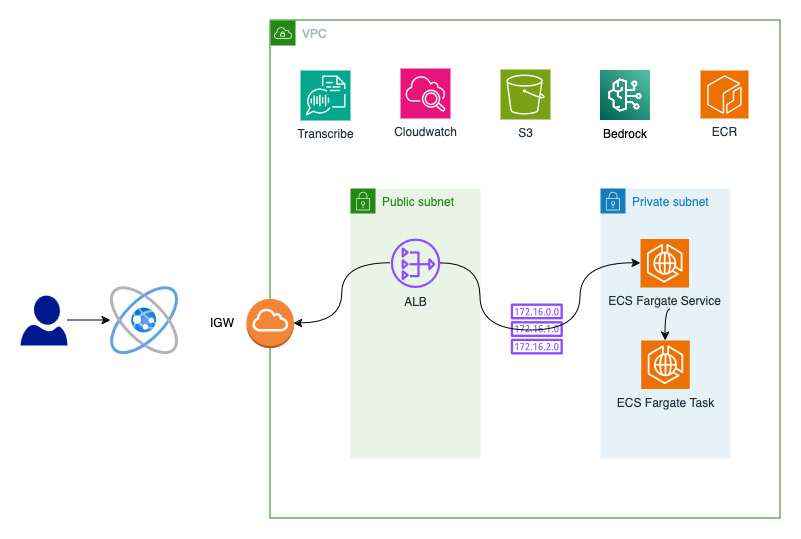

# Bedrock Summariser

This is a simple web app build on Node.js that allows you to summarise a conversation using your web browser microphone using AWS Bedrock. 


## Description

This app best runs in Chrome. It's a client server app using Node.js Express as middleware.  Front end is HTML and Javascript. Back end uses Amazon Transcribe to convert the voice recording to text and Amazon Bedrock to summarise the recording.


## Getting Started

Ping @oliverle on slack to talk about contributing and getting started. You need run the following commands to build the docker container but you need an AWS Environment to run the docker image. I use ECS Fargate. 


### AWS Services Used

  - Amazon Transcribe
  - Amazon ECS on Fargate
  - Amazon Bedrock
  - Amazon S3
  - Amazon CloudWatch
  - Amazon Elastic Container Registry


Here's the architecture:




## How to build the docker image locally or using ECR

1 - To build a docker image locally, make sure you have NPM installed and have cloned the git repo.

```
git clone git@ssh.gitlab.aws.dev:oliverle/bedrock-summeriser.git
sh build.sh
```

2 -  To run this in ECS Fargate, you need to build the image first. Make sure you have an existing ECR repo. If not, run this command

```
aws ecr create-repository \
--repository-name bedrock-summeriser \
--image-scanning-configuration scanOnPush=false \
--image-tag-mutability MUTABLE \
--region eu-west-2
```

3 - Create a ECR repo in your region you have deployed ECS Fargate in

update the push.sh file with your repo you have created. Then run:

```
sh push.sh
```

Then, build an ECS Fargate cluster, task definition and service. Make sure you have the other AWS services, VPC, subnets, etc. 
There is a CFN stak that will create a VPC for you in the resources folder. Run the following command from the root of this project.

```
aws cloudformation create-stack \
--stack-name vpc-1 \
--template-body file://resources/vpc.yaml \
--region eu-west-2 --capabilities CAPABILITY_NAMED_IAM
```

## Project config

You can configure the variables in ```src/libs/variables.js``` and changed your region. Not, today, Amazon Bedrock only runs in certain regions, so I use us-east-1. You will need to create an S3 bucket and add this bucket name to the ```src/libs/variables.js``` file.


## Authors

Contributors names and contact info.

Oli Leach @oliverle


## Version History

* 0.1
    * Initial Release

## License


This project is licensed under the MIT License - see the LICENSE.md file for details

## Acknowledgments


Inspiration, code snippets, etc. Thank the internet.